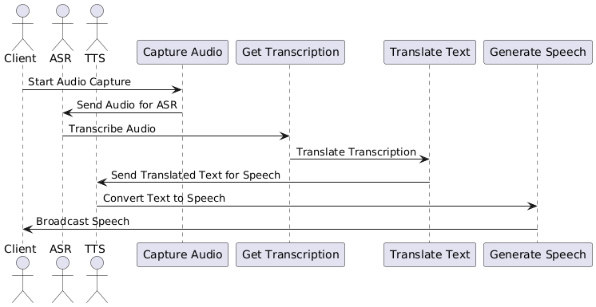

# 🌐 Real-Time Video Translation Web App

This project is a **real-time video communication platform** that integrates **speech recognition, translation**, and **speech synthesis** into a seamless web application. Built using **WebRTC**, **Node.js**, and **Google Cloud APIs**, it allows users to speak in one language and hear the translation in another — **live during video calls**.

---

## 🚀 Features

- 🎥 Real-time video and audio calls (WebRTC)
- 🗣️ Automatic Speech Recognition (ASR)
- 🌍 Real-time translation between multiple languages
- 🔊 Speech synthesis for translated output
- 💬 Display of original and translated text
- 🧪 Simple frontend with mic/cam controls
- 📦 Easily deployable via Node.js

---

## 🧰 Tech Stack

- **Frontend**: HTML, CSS, JavaScript  
- **Backend**: Node.js, Express, Socket.IO  
- **APIs**:
  - Google Cloud Speech-to-Text  
  - Google Cloud Translation  
  - Google Cloud Text-to-Speech  
- **WebRTC**: Peer-to-peer media streaming  

---

## 📁 Project Structure

```
rtm/
├── index.html              # Frontend UI
├── index.js                # Node.js server
├── css/
│   └── main.css            # Stylesheet
├── js/
│   └── main.js             # Client-side logic (stream, translation)
├── package.json            # Node dependencies
├── node_modules/           # Installed packages
├── media/
│   ├── flow diagram.png    # Sequence Diagram
│   └── rtmworking.png      # System Architecture Diagram
```

---

## ⚙️ Prerequisites

- Node.js (v18+ recommended)
- Google Cloud project with:
  - Speech-to-Text API enabled
  - Translation API enabled
  - Text-to-Speech API enabled
- Service account key file (JSON)

---

## 🛠️ Getting Started

1. **Download and extract the project ZIP**

2. **Open a terminal and navigate into the project directory**

```bash
cd rtm
```

3. **Install dependencies**

```bash
npm install
```

4. **Set Google Cloud credentials**

```bash
export GOOGLE_APPLICATION_CREDENTIALS="path/to/your-key.json"
```

5. **Start the server**

```bash
node index.js
```

6. **Open your browser and visit**

```
http://localhost:5000
```

---

## 🌍 How It Works

The system performs **live audio translation** during video calls by chaining together speech recognition, translation, and text-to-speech components.

### 🔁 Workflow Sequence



1. The client captures microphone audio.
2. Audio is transcribed via ASR (Speech-to-Text).
3. Transcription is translated using a cloud-based translation model.
4. The translated text is spoken aloud using Text-to-Speech (TTS).
5. Output is broadcast back to users.

---

### 🧠 System Architecture


- **Frontend** handles UI controls, language selection, and user media (video/audio).
- **main.js** performs speech recognition, translation, and synthesis.
- **Backend (index.js)** manages room connections via Socket.IO and forwards messages for translation.


---

## 🛠️ To Do / Enhancements

- Add UI for selecting input/output language
- Improve sentence segmentation and flow
- Optimize speech-to-text latency
- Enhance frontend styling and UX
- Add support for multiple peers per room

---

## 📄 License

This project is licensed under the **MIT License**.

Thank you 
#
